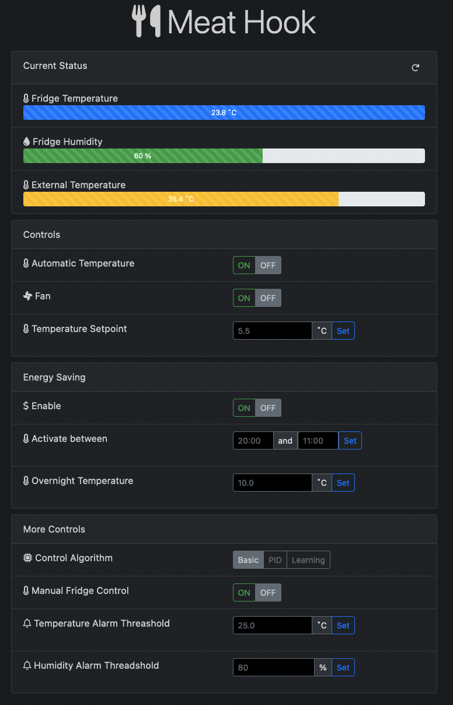

# Meat Hook

Meat Hook is a temperature and humidity controlled fridge for dry aging meat.
This project goes through designing the circuit and PCB as well as the surrounding full-stack web application and data
logging utilities. It also explores using various control algorithms including basic, PID, and machine learning approaches.

The controller is based on the [Particle Photon](http://www.particle.io), a Wifi enabled ARM based processor with a cloud-based API.
The web application backend is written in Python using the Flask framework. The frontend uses HTML and Javascript, leveraging the Bootstrap framework.

## Circuit and PCB Design

Below is a simple block diagram showing the sensors and actuators in the fridge.

